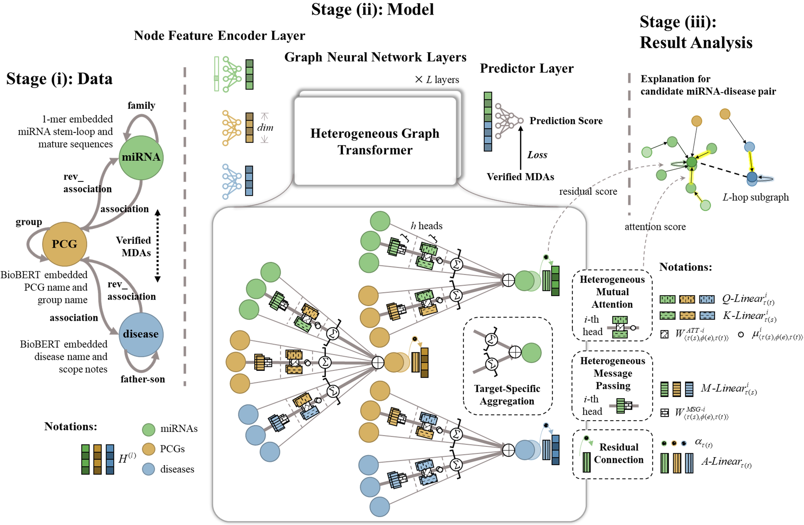

# Generalizable and explainable prediction of potential miRNA-disease associations based on heterogeneous graph learning



## Data and source codes

```bash
└─ EGPMDA
    ├─ data
        ├─ associations
            ├─ DisGeNET     # raw data from DisGeNet
            ├─ ENCORI       # raw data from ENCORI
            ├─ RNADisease   # raw data from RNADisease
            └─ HumanNet     # raw data from HumanNet
        ├─ disease
            └─ MeSH         # raw data from MeSH
        ├─ miRNA
            └─ miRBase      # raw data from miRBase
        ├─ mRNA
            └─ HGNC         # raw data from HGNC
        ├─ README.md        # more details about how to get raw data
        ├─ biobert-pytorch  # please clone BioBERT* here
        ├─ our_data         # our processed data, please download and unzip from My Drive*
            └─ ...
        ├─ dataset_construction.ipynb   # codes of the dataset construction
        └─ preprocessing.ipynb          # codes of the data preprocessing
    ├─ files
        ├─ case_study       # prediction results and attention values (extracted while running)
        ├─ figures
        └─ models           # trained models
    ├─ main.py          # settings, training and evaluation
    ├─ model.py         # our EGPMDA
    ├─ utils.py         # functions utilized in the training and evaluation process
    ├─ analysis_and_case_study.ipynb    # codes of result analysis and case-by-case explanations
    ├─ hgt_conv_case_study.py           # modified torch_geometric.nn.HGTConv for exlanation
    ├─ similarity_utils.py
    └─ README.md
```

Attention*:  
- [BioBERT](https://github.com/dmis-lab/biobert-pytorch) 
- [My Drive](https://drive.google.com/file/d/1eZ_tMMoMC0_B8Js41DlsBnRW3wRaJAy5/view?usp=drive_link)  

## Dependencies

- pandas 1.2.4  
numpy 1.20.1  

- torch 1.10.0  
**torch_geometric 2.2.0**  
**torch_sparse 0.6.16**  

- sklearn 0.24.1  
networkx 3.0  
h5py 2.10.0  

- Bio 1.79  
sqlite3 2.6.0  
bs4 4.9.3  

## Concat

There are detailed comments in the code, hope they are helpful.  
If you have any questions, welcome to contact me at zhouyi2@stu.scu.edu.cn or echochou99@163.com!
